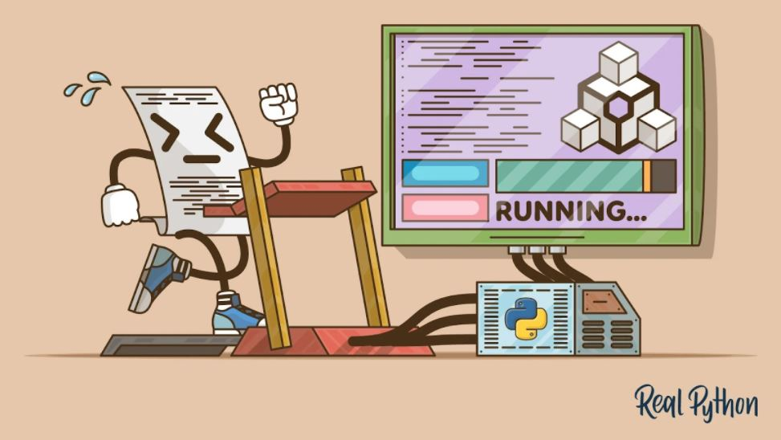

<div id="top"></div>


<!-- PROJECT LOGO -->
<div align="center">
    
  </a>

  <h3 align="center">Implementasi Compiler Python dengan Menerapkan Algoritma Cocke Younger Kasami</h3>

</div>


<!-- TABLE OF CONTENTS -->
<details>
  <summary>Table of Contents</summary>
  <ol>
    <li><a href="#Tentang-Project">Tentang Project</a></li>
    <li><a href="#Mulai">Mulai</a>
        <ul><a href="#Menjalankan-Program-Utama">Menjalankan Program Utama</ul>
        <ul><a href="#Update-CFG">Update CFG</ul>
    </li>
    <li><a href="#Bug">Bug</a></li>
  </ol>
</details>


<!-- ABOUT THE PROJECT -->
## Tentang Project

Pada tugas besar ini, diimplementasikan compiler untuk Python untuk statement-statement dan sintaks-sintaks bawaan Python. Digunakan konsep CFG untuk pengerjaan compiler yang mengevaluasi syntax program. Untuk nama variabel dalam program menggunakan Regular Expression, dan untuk comment dan string menggunakan Finite Automata.

Syntax python yang didukung :
<div align="center">
<style type="text/css">
.tg  {border-collapse:collapse;border-spacing:0;}
.tg td{border-color:gray;border-style:solid;border-width:1px;font-family:"Courier New", sans-serif;font-size:14px;
  overflow:hidden;padding:10px 5px;word-break:normal;}
.tg th{border-color:gray;border-style:solid;border-width:1px;font-family:"Courier New", sans-serif;font-size:14px;
  font-weight:normal;overflow:hidden;padding:10px 5px;word-break:normal;}
.tg .tg-c3ow{border-color:gray;text-align:center;vertical-align:top}
.tg .tg-3ib7{border-color:gray;font-family:"Courier New", Courier, monospace !important;;text-align:center;vertical-align:top}
</style>
<table class="tg">
<thead><tr><th class="tg-0lax">True</th><th class="tg-0lax">False</th><th class="tg-0lax">from</th><th class="tg-0lax">import</th><th class="tg-0lax">as</th></tr></thead>
<tbody>
  <tr><td class="tg-0lax">if</td><td class="tg-0lax">elif</td><td class="tg-0lax">else</td><td class="tg-0lax">None</td><td class="tg-0lax">break</td></tr>
  <tr><td class="tg-0lax">and</td><td class="tg-0lax">or</td><td class="tg-0lax">not</td><td class="tg-0lax">is</td><td class="tg-0lax">pass</td></tr>
  <tr><td class="tg-0lax">for</td><td class="tg-0lax">while</td><td class="tg-0lax">in</td><td class="tg-0lax">raise</td><td class="tg-0lax">continue</td></tr>
  <tr><td class="tg-0lax">def</td><td class="tg-0lax">return</td><td class="tg-0lax">class</td><td class="tg-0lax">with</td><td class="tg-0lax"></td></tr>
</tbody>
</table>
</div>


<!-- GETTING STARTED -->
## Mulai

### Menjalankan Program Utama

Untuk menjalankan program jalankan command berikut di terminal
* python
    ```sh
    python parserprogram.py <nama_file>
    ```

### Update CFG

Untuk update CFG lakukan langkah langkah berikut :
1. Ubah CFG dengan format seperti contoh berikut
   ``` 
    Terminals: 
    a b
    Variables:
    S A B C
    Productions:
    S -> A B | B C;
    A -> B A | a;
    B -> C C | b;
    C -> A B | a 
    ```
2. Jalankan command berikut di terminal :
    ```sh
    python CFG2CNF.py CFG.txt
    ```
3. Hapus blank space terakhir yang terbentuk di CNF.txt


<!-- Bug yang diketahui -->
## Bug 

Beberapa sytax ada yang tidak sesuai dengan python, diantaranya:

1. Untuk menulis content pada comment dibutuhkan spasi.
2. Untuk comment single line dibutuhkan atribut tambahan di bagian belakang yaitu \n
    
    ```
    #<space><content><space>\n
    '''<space><content><space>'''
    """<space><content><space>"""
    ```


<p align="right">(<a href="#top">back to top</a>)</p>